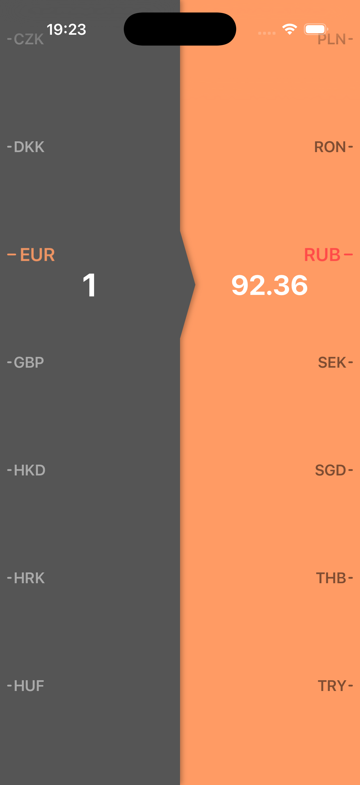
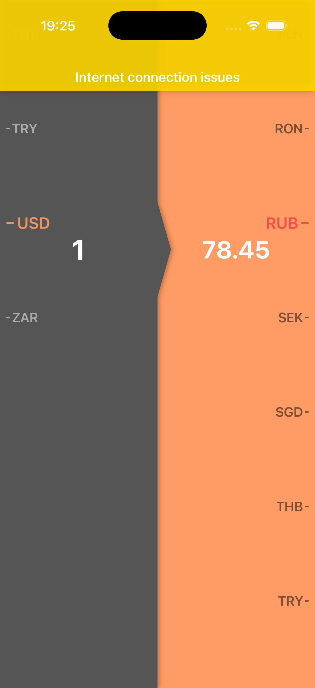

# CurrencyApp

## Описание

CurrencyApp — это iOS приложение для конвертации валют, позволяющее пользователям выбирать базовую и целевую валюты, вводить сумму и получать результат конвертации в реальном времени. Приложение использует внешний API для получения актуальных курсов валют и реализует кэширование данных для работы в офлайн-режиме.

## Задача

Разработать iOS приложение для конвертации валют со следующими требованиями:

- Отображение списка доступных валют
- Выбор базовой и целевой валюты
- Ввод суммы для конвертации
- Получение актуальных курсов валют через API
- Кэширование данных для работы без интернета
- Обработка ошибок сети и отображение пользователю
- Реактивное обновление результата при изменении валют или суммы

## Решение

Приложение реализовано с использованием архитектуры **MVVM (Model-View-ViewModel)** в сочетании с паттерном **Coordinator** для управления навигацией.

### Ключевые особенности

- **Кастомные wheel пикеры**: Реализация выбора валют и ввода суммы через кастомные компоненты с wheel picker стилем
- **Кэширование**: Приложение сохраняет список валют и курсы обмена локально. При отсутствии сети используются кэшированные данные (даже если они устарели). При возобновлении сетевого соединения данные обновлятся до актуальных.
- **Реактивность**: Использование паттерна `Bindable` для реактивного обновления UI при изменении данных
- **Обработка ошибок**: Централизованная обработка ошибок сети с понятными сообщениями для пользователя
- **Оптимизация запросов**: Курсы обмена кэшируются в памяти ViewModel для избежания повторных запросов к API

## Технический стек

- **Язык**: Swift
- **UI Framework**: UIKit
- **Архитектура**: MVVM + Coordinator Pattern
- **Сетевая библиотека**: URLSession (нативный)
- **API**: [FreeCurrencyAPI](https://freecurrencyapi.com/)
- **Хранение данных**: FileStorage (временное хранилище)

## Скриншоты

<table>
  <tr>
    <td style="border: none;"></td>
    <td style="border: none;"></td>
    <td style="border: none;"></td>
  </tr>
</table>

